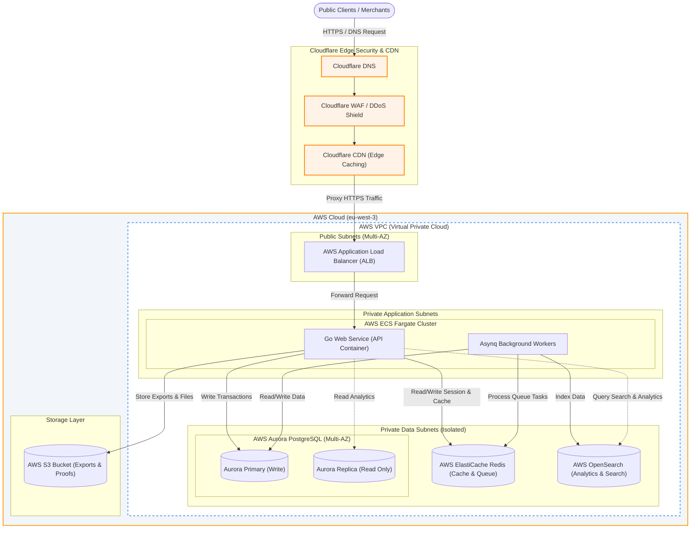
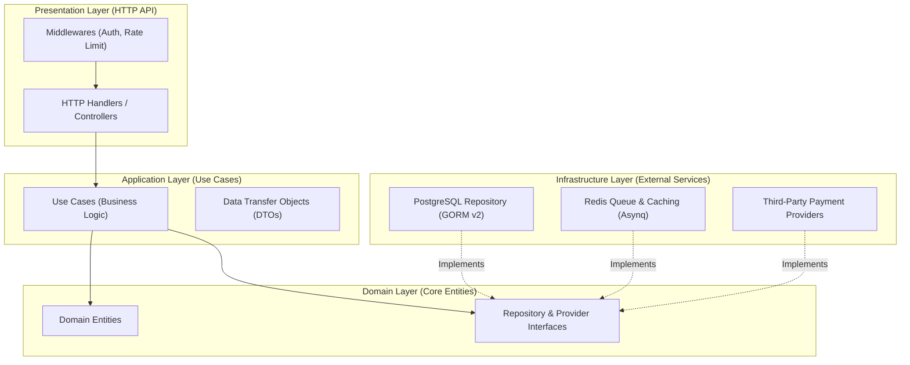
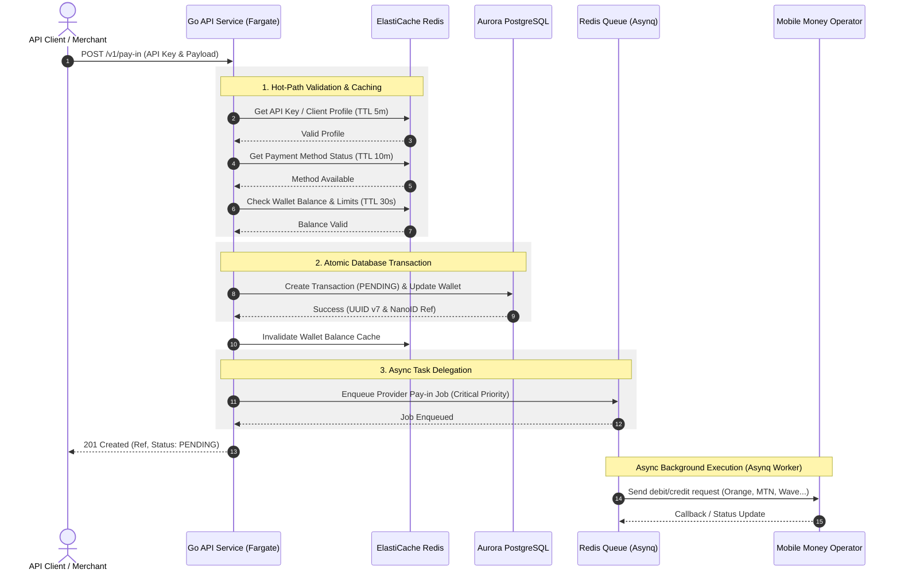
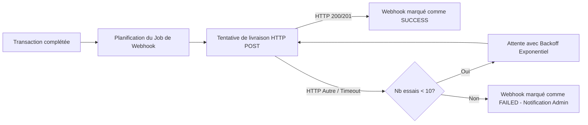

  

<h1 align="center">🚀 Velyon Core</h1>

  <strong>Engineering high-performance, resilient, and secure financial technology.</strong>

  Bienvenue sur le hub d'ingénierie de <strong>Velyon Core</strong>, l'équipe technique à l'origine d'une passerelle de paiement mobile money hautement performante et résiliente.

  Cette page présente l'architecture globale, la stack technique, les services critiques et les choix d'ingénierie qui garantissent la scalabilité, la sécurité et la haute disponibilité de notre plateforme.

---

## 🛠️ Stack Technique

Notre infrastructure et nos applications sont construites avec des technologies modernes, choisies pour leur performance brute, leur typage fort et leur intégration dans l'écosystème Cloud Serverless.

| Couche | Technologies | Détails & Versions |
| :--- | :--- | :--- |
| **Backend API** |   | Code natif (`net/http`), GORM v2, Logs structurés (`slog`), Zéro framework HTTP externe. |
| **Traitement Asynchrone** |  | Files d'attente distribuées basées sur Redis via la bibliothèque `Asynq`. |
| **Frontend** |   | Single Page Application réactive, graphiques temps réel avec `Chart.js` & `Lucide Icons`. |
| **Bases de Données** |  | Rapprochement de données, indexation transactionnelle et réplication Multi-AZ. |
| **Recherche & Analytics** |  | Indexation asynchrone des transactions pour la recherche rapide et les agrégations du dashboard. |
| **DevOps & Infra** |   | Infrastructure as Code (IaC) complète. Déploiement conteneurisé serverless (ECS Fargate). |

---

## 🏗️ Schémas d'Architecture

### 1. Architecture Infrastructure (AWS Cloud)
Notre infrastructure est entièrement hébergée sur Amazon Web Services (AWS) et orchestrée par Terraform. Elle repose sur des services managés pour éliminer la maintenance de serveurs et garantir une scalabilité horizontale automatique.

---

### 2. Architecture Logicielle (Clean Architecture Backend)
Le code backend en Go suit strictement les principes de la **Clean Architecture**, assurant une séparation claire des responsabilités et une testabilité maximale. Les dépendances pointent uniquement vers l'intérieur (vers le Domain), et toutes les implémentations externes sont injectées au démarrage.

---

### 3. Flux Transactionnel Optimisé (Hot Path)
Pour maintenir un temps de réponse moyen **inférieur à 300 ms** sur l'initiation des paiements (Hot Path), l'API valide d'abord les données via Redis avant d'effectuer une transaction unique dans la base de données PostgreSQL Aurora. Les opérations lourdes (appels API opérateurs, webhooks) sont immédiatement déportées dans la file d'attente asynchrone.

---

## ⚙️ Services Critiques

### 1. Système de Queue et Traitement Asynchrone
Toutes les tâches complexes ou sujettes aux pannes externes sont encapsulées dans des jobs persistés sous Redis. 

*   **At-least-once delivery** : Chaque tâche est garantie d'être exécutée au moins une fois.
*   **Idempotence** : Tous les workers sont conçus pour être relancés en cas d'erreur sans causer d'effets de bord financiers.
*   **Observabilité** : Suivi rigoureux du statut des tâches, de leur durée d'exécution et de l'historique des erreurs.

#### Priorités des files d'attente
| Type de Job | Déclencheur | Priorité | Garantie |
| :--- | :--- | :--- | :--- |
| **Appel Fournisseur** | Création de transaction pay-in/payout | **Critique** | Exécution immédiate |
| **Livraison Webhook** | Changement de statut de transaction | **Critique** | Retry avec backoff exponentiel |
| **Réessai Webhook** | Échec de livraison précédent | **Haute** | Intervalle progressif |
| **Indexation OpenSearch** | Écriture de données en base | **Normale** | Traitement sous < 2s |
| **Vérification Statut Provider** | Post-transaction différée (polling) | **Normale** | Exécution en tâche de fond |
| **Réconciliation & Rapports** | Tâches périodiques ou demande manuelle | **Basse** | Exécution asynchrone |

---

### 2. Suivi des Soldes (Wallets) & Réconciliation
La précision financière est assurée par un modèle transactionnel strict :

*   **Atomicité** : Le solde du portefeuille (Wallet) et le relevé détaillé de l'opération sont écrits dans la **même transaction de base de données**.
*   **Dirty Tracking** : Seuls les champs modifiés sont écrits afin d'éviter tout écrasement concurrent ou perte de données.
*   **Piste d'Audit** : Chaque ligne de relevé enregistre l'état exact du solde *avant* et *après* l'opération, créant un historique inaltérable.
*   **Réconciliation Automatique** : Un moteur planifié compare régulièrement le solde calculé (somme des relevés système) avec le solde communiqué par les opérateurs partenaires. Tout écart déclenche une alerte critique immédiate.

---

### 3. Cycle de Vie et Sécurité des Webhooks
Les webhooks notifient en temps réel les serveurs marchands des changements de statut des transactions.

#### Signature & Intégrité
Pour chaque webhook envoyé, nous incluons des en-têtes de sécurité stricts pour permettre au marchand de valider l'authenticité de la requête :
*   `X-Velyon-Signature` : Signature **HMAC-SHA256** du corps du payload utilisant la clé secrète du webhook du marchand (`webhook_secret`).
*   `X-Velyon-Timestamp` : Horodatage Unix de l'envoi pour prévenir les attaques par rejeu (Replay Attacks).
*   `X-Velyon-Event` : Type d'événement déclencheur (ex: `transaction.completed`).

#### Politique de relance (Exponential Backoff)
Si le serveur du marchand ne répond pas avec un statut HTTP 2xx, nous réessayons jusqu'à 10 fois sur un intervalle cumulé de près de **49 heures** :
1. Immédiat (0s)
2. +10s (cumul : 10s)
3. +1min (cumul : 1m 10s)
4. +5min (cumul : 6m 10s)
5. +15min (cumul : 21m 10s)
6. +1h (cumul : 1h 21m)
7. +4h (cumul : 5h 21m)
8. +8h (cumul : 13h 21m)
9. +12h (cumul : 25h 21m)
10. +24h (cumul : 49h 21m)

---

## 🔒 Sécurité et Conformité

Notre plateforme met en œuvre les standards de sécurité les plus stricts de l'industrie fintech :

*   **Chiffrement des Données** :
    *   *Au repos* : Chiffrement **AES-256-GCM** de tous les secrets sensibles (clés API opérateurs, identifiants marchands) stockés en base de données.
    *   *En transit* : Communication exclusivement sous **TLS 1.2+** avec des suites de chiffrement sécurisées.
*   **Authentification et Autorisations** :
    *   *API Publique* : Authentification par paire de clés API robustes (`API Key` + `API Secret`).
    *   *Backoffice* : Jetons **JWT** signés et sécurisés avec double authentification obligatoire (**OTP - One-Time Password**) pour tous les administrateurs et collaborateurs.
*   **Bonnes Pratiques de Développement** :
    *   Validation stricte de toutes les entrées utilisateur pour se prémunir des injections SQL et attaques XSS.
    *   Comparaison de signatures cryptographiques en **temps constant** pour prévenir les attaques par timing (Timing Attacks).
    *   Aucun secret n'est écrit en clair dans le code source ou dans les dépôts GitHub (utilisation d'AWS Secrets Manager et variables d'environnement chiffrées).
    *   *Soft Delete* systématique pour préserver l'historique et éviter les pertes accidentelles de données.

---

## 📈 Objectifs de Service (SLA & SLI)

| Métrique | Cible / Objectif |
| :--- | :--- |
| **Disponibilité globale de l'API (Uptime)** | **99.9%** |
| **Temps de réponse moyen (Hot Path)** | **< 300 ms** |
| **RPO (Recovery Point Objective)** | **< 5 minutes** (perte maximale tolérée en cas de sinistre) |
| **RTO (Recovery Time Objective)** | **< 15 minutes** (temps de rétablissement complet du service) |

---

*Pour toute question concernant l'utilisation des APIs ou les contributions de code, veuillez vous référer aux documentations internes ou contacter l'équipe d'ingénierie à dev@velyon.com.*
